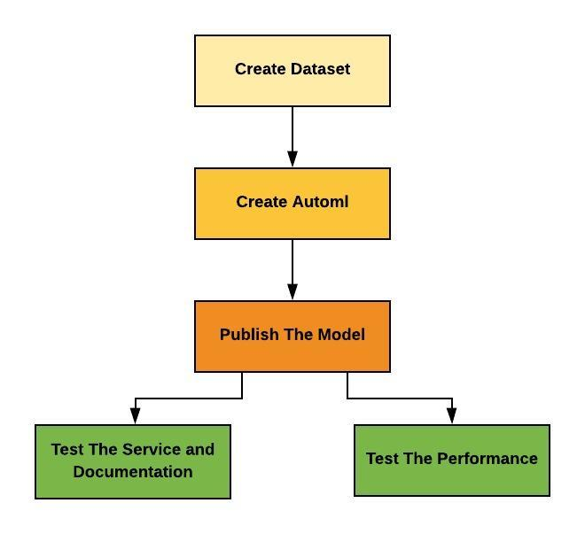

# Deposite Subscription Perdiction

In this project we will predict if a client will subscribe to a fixed term deposit using Azure Automl, we will create the experiment, get the best model and deploy that model as a restful web service, after that we will create a documentation for the service using swagger, and to make sure that the service will run normally in production and serve the requests in good way we will make a performance test using Apache Benchmarking tool.

## Architectural Diagram

## Key Steps

1. Create Dataset 

in this step we will create the dataset that we will use in our experiment 

we can explore our dataset from the designer to get some intuition about data

2. Creating Automl

In this step we create automl from designer, where we choose the dataset that we will work on it, we choose the type of model which is classifcation and the column that we need to predict, then we choose or create the compute cluster if it's not exist,the automl compares different models with different paramters to get the best model 

3. Publish The Model

after the run has been comleted we can puplish the model as a restful web service that we can use to consume the model

we have enabled the application insights which enable us to log the service to know what happens in the service and keep tracking of its behaviuor

here is a log for the service after running the logs.py 

4. Test The Service and Documentation

After the model is running and active we can consume the model using the endpoint URL and the key of the service. we can also using the swagger to get a documentation for the service

5. Test The Performance

We can test the performance of the service and make sure it has a good response time and it can work soomthly in production on heavy usage using Apache Bechmarking tool

## Screen Recording

Here is a short recording for the Automl Experiment, you can watch by clicking [here](https://www.youtube.com/watch?v=6XTS1KLii2k&feature=youtu.be)

## AutML Using Azure Python SDK

We can create AutoML experiment and publish our model using python and Azure SDK

## Key Steps
1. Intialize Experiment
initialize your workspace from config file

2. Create Experiment
in this step we check for the experiment if it's exist our code will make new run in the existing experiment, and if it's not exist we will create a new one

1. Create Dataset 
in this step we will create the dataset that we will use in our experiment 

1. Automl Configuraion
after creating our experiment and regsiter the dataset we will start creating our AutoML by first configuring the automl by defining some parameters such as the compute traget, and the type of task we need to accomlish such as Classification and other paramters
5. Create AutoML Step
To create our pipline we need first to create the steps of this pipline which can contains one or more step, and this can help us to modulize our code we can create create some steps and using them in different ways which makes our code more resuable

6. Create Pipline
Here is the actual pipline that we will run and submit to get the result, we using the steps that we create perviuosly as parameter to our pipline

7. Sumit Pipline and get the best Model
after creating the pipline we will submit and waiting for it to complete running and get the best model, where the automl compares different models with different paramters to get the best model 

1. Publish The Model

after the run has been completed we can use the SDK to publish the service

## Standout Suggestions

As we have noticed in the project that we didn't explore the dataset and analyze it, we should first study the dataset to make the required cleansing, find if we can making feature engineering, find the co-correlated colums, remove unnecessary columns that does not have impact on the prediction

another thing we can look at in the data is the data drift that we need to handle if the relation between input and ouput which will affect the behaviuor of the model

For we service logging, in the production we need to track the behaviuor of service and we will not track manually we need to add notification with the logger to send notification to the team if there is a seriuos issue in the service

we can make a dashboard for the service usage and the logger and get relevant information about the service
